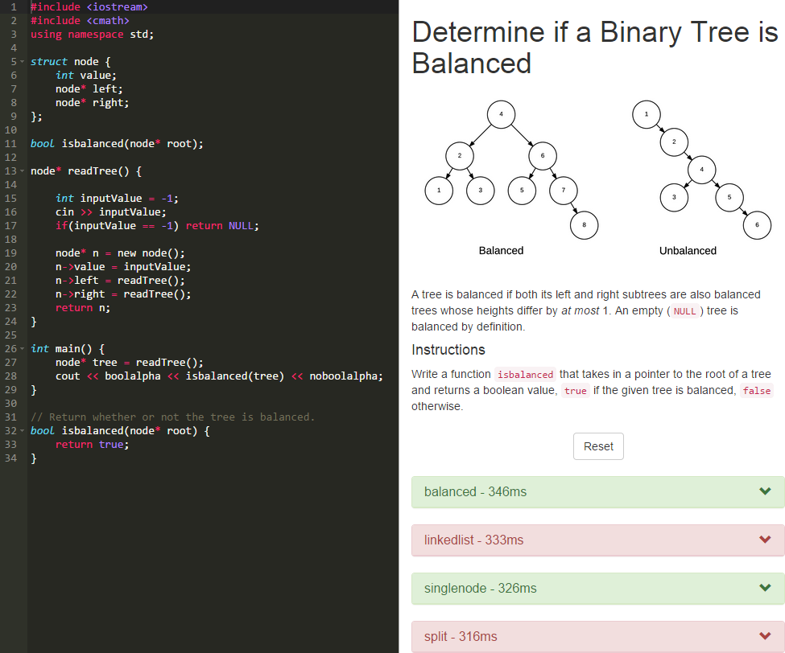

# Live C++ Coding
Live C++ coding tool, for CS106B section leading.

## Features
- Automatically runs tests on Ctrl-S / Cmd-S
- Using TogetherJS, you can invite multiple people to edit at the same time
- Simple to add new problems and tests

## Set-up
1. Clone the repo with `git clone https://github.com/rameshvarun/livecpp`
2. Navigate into the directory, and run `npm install`
3. Run `node app.js` (may require `sudo` to bind to port `80`)
4. (Optional) Install ngrok and run `ngrok 80` to expose the application to others
